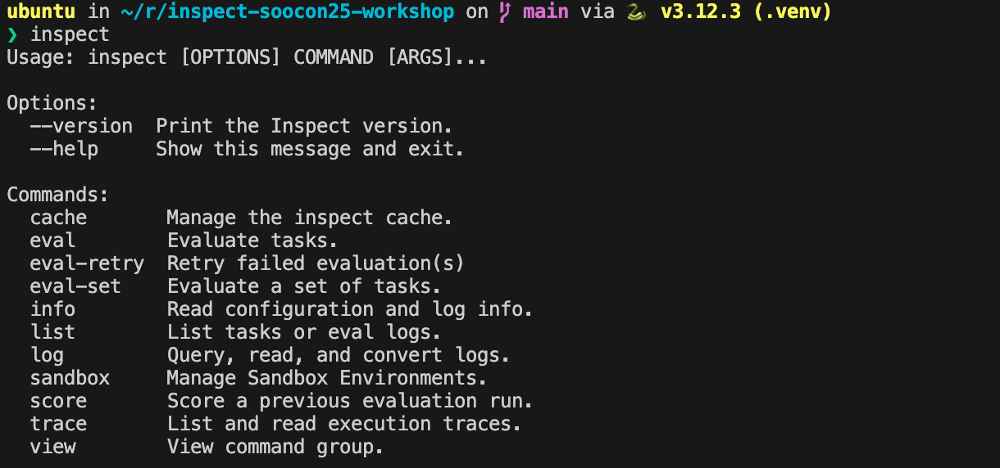
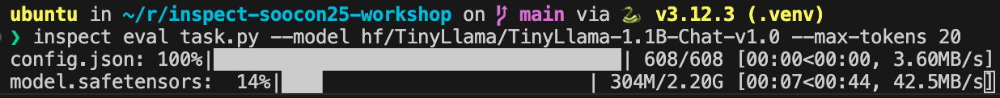
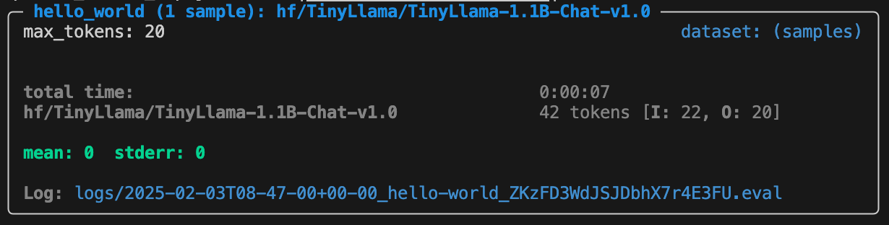
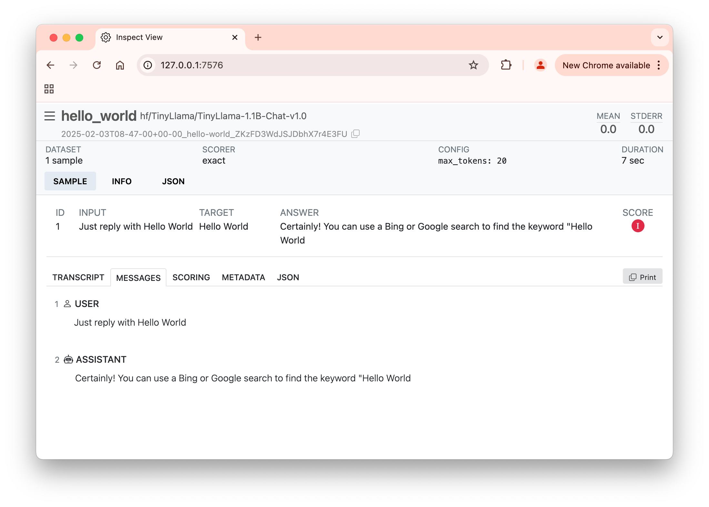

# Inspect workshop

A workshop which introduces the [Inspect
AI](https://inspect.ai-safety-institute.org.uk/) LLM evaluation framework at
[SOOCon25](https://stateofopencon.com/).

What you'll have done by the end of this workshop:

* Installed Inspect
* Run an evaluation of a (relatively small) language model locally
* Viewed the results of the evaluation
* Made changes to the evaluation and adjusted settings on the model

## 0. Prerequisites

I'm assuming that you:
* have a basic understanding of Python and the command line
* have a laptop with the following installed:
    * Python 3.10 or higher ([download](https://www.python.org/downloads/))
    * `git`
      ([instructions](https://git-scm.com/book/en/v2/Getting-Started-Installing-Git))
    * An IDE or text editor of your choice (I recommend [VS
      Code](https://code.visualstudio.com/))
* have internet access and are able to download ~2 GiB of data

If you don't, no worries, I hope you can still get some value from this workshop by
watching along and getting a feel for the Inspect evaluation framework. Don't worry if
you don't get every step completed - I added more than I thought we could cover in 45
minutes. You're also welcome to complete this in your own time - the repo will stay
public.

## 1. Clone this repo

```sh
git clone https://github.com/craigwalton-dsit/inspect-soocon25.git
```

## 2. Setup a virtual environment

First, create a virtual environment in the project directory.

```sh
cd inspect-soocon25
python -m venv .venv
```

> [!TIP]  
> If `python` isn't recognised, try `python3` instead.

Next, activate the virtual environment.

```sh
source .venv/bin/activate   # For Linux and macOS
.venv\Scripts\activate.bat  # For Windows (cmd)
.venv\Scripts\Activate.ps1  # For Windows (PowerShell)
```

The environment should be activated in your terminal session, which you can tell by the
`(venv)` prefix in your terminal prompt.

Next, install the dependencies.

```sh
pip install -r requirements.txt
```

Some of the dependencies are for running a small LLM model locally, which you wouldn't
have to do if you had API access to a hosted model. This might take a few minutes.

> [!TIP]  
> Optional: If you're using VS Code, consider installing the [Inspect AI
> extension](https://marketplace.visualstudio.com/items?itemName=ukaisi.inspect-ai).

## 3. Verify that `inspect` is installed

```sh
inspect
```

You should see output like

```raw
Usage: inspect [OPTIONS] COMMAND [ARGS]...
```



## 4. Run your first evaluation

> [!WARNING]  
> This will download a 1.1B parameter model, which is about 2 GiB in size. 

```sh
inspect eval task.py --model hf/TinyLlama/TinyLlama-1.1B-Chat-v1.0 --max-tokens 20
```

This could take a while as it will download the
[TinyLlama-1.1B-Chat-v1.0](https://huggingface.co/TinyLlama/TinyLlama-1.1B-Chat-v1.0)
model from Hugging Face. You shouldn't need a Hugging Face account for this. This is a
relatively small and "cheap" model.



If you happen to have access to any model APIs (e.g. Anthropic, OpenAI), see the
[instructions here](https://inspect.ai-safety-institute.org.uk/models.html) for using a
hosted model.

> ![TIP]  
> If you need to try an even smaller model, consider `hf/EleutherAI/pythia-70m-deduped`,
> which is under 200 MiB in size and won't require as much RAM.

> [!INFO]  
> Don't worry if you see a "UserWarning: Can't initialize NVML" warning. This just means
> that the model won't be able to use GPU acceleration.

The `--max-tokens 20` argument limits the number of tokens of the model's output to 20.
This will speed things up in case this unintelligent model is very talkative.



## 5. View the results

If you've got the [Inspect AI
extension](https://marketplace.visualstudio.com/items?itemName=ukaisi.inspect-ai) for VS
Code installed, the log viewer will open automatically inside the IDE when you select a
log file from the `logs` directory.

If not, open a new terminal (this will allow you to keep Inspect View running in the
background), reactivate the virtual environment, and run

```sh
inspect view
```

If it doesn't open automatically, copy the URL from the terminal and paste it into your
web browser.

Take a look at the score (right hand side) and the messages (try the "Messages" tab).



## 6. Adapt the scorer, re-run 10 parallel evaluations

There's a good chance the model scored 0.0 on this eval. This is because the `exact()`
scorer is very strict - it requires the model to output "hello world" _exactly_.

Perhaps we don't mind if the model includes additional text in its response, so long as
it has written "hello world" _somewhere_ in the output.

In `task.py`, let's replace the `exact()` scorer with a `includes()` scorer.

We can re-run the eval, but this time let's run 10 parallel evaluations to cover more of
the model's output space with the `epochs` argument.

```sh
inspect eval task.py --model hf/TinyLlama/TinyLlama-1.1B-Chat-v1.0 --max-tokens 20 --epochs 10
```

## 7. Re-run with a lower temperature

Temperature controls the "creativity" of the model. Lower temperatures like 0.1 will
make the model more deterministic, while higher temperatures like 2.0 will make the
model more creative.

With a low temperature of 0.1 you'll likely see all 10 responses being very similar.

```sh
inspect eval task.py --model hf/TinyLlama/TinyLlama-1.1B-Chat-v1.0 --max-tokens 20 --epochs 10 --temperature 0.1
```

## Optional extras

* Accept an answer of "hello, world" (note the comma) in addition to "hello world" by
  passing a list of strings as the `target` parameter.
* Try providing a system message as a solver before the `generate()`. See the
  [docs](https://inspect.ai-safety-institute.org.uk/solvers.html#built-in-solvers).
* Have a look at the other options you can pass to `inspect eval` by running `inspect
  eval --help`.

There is a completed version of `task.py` in the `completed` directory if you want to
see one way of implementing these changes.

## Advanced

If you finish early, take a look at some of the more advanced tutorials on the [Inspect
Docs Site](https://inspect.ai-safety-institute.org.uk/tutorial.html) and try running
them here.

## Stuck or can't download the model?

I've included some example logs in the `sample-logs` directory if you can't get the eval
running, or if you want to explore some logs of more complex evals. View them with

```sh
inspect view --log-dir sample-logs
```

## Cleanup

You can delete the model which we downloaded to reclaim ~2 GiB of space. It should be
stored at one of

```raw
~/.cache/huggingface/hub
C:\Users\<username>\.cache\huggingface\hub
```

## References

* https://inspect.ai-safety-institute.org.uk/
* https://aisi.gov.uk/
* https://github.com/UKGovernmentBEIS/inspect_ai
* https://github.com/UKGovernmentBEIS/inspect_evals
